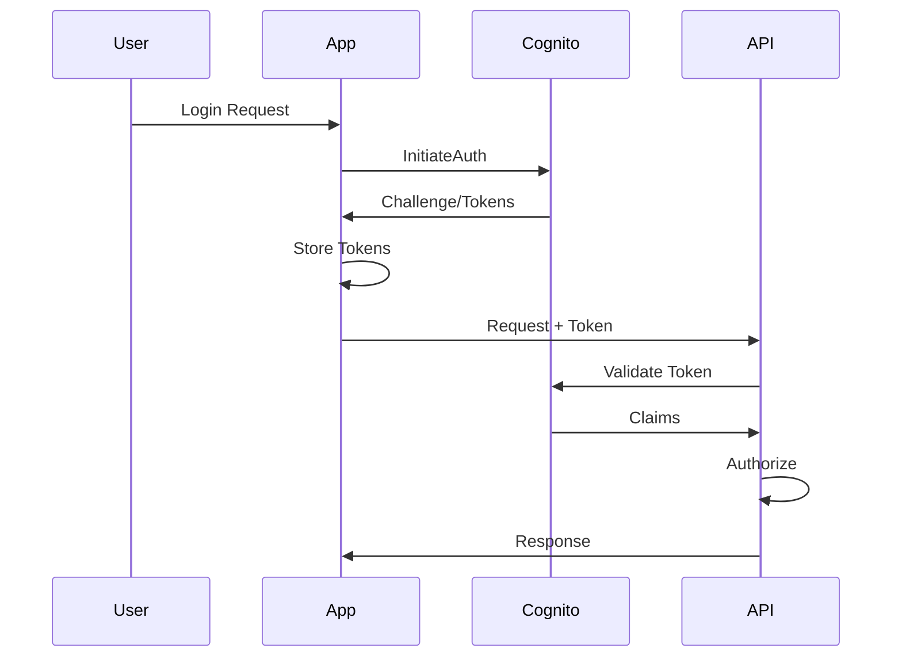

# Authentication Standards

## Overview
AWS Cognito is our preferred authentication service for all applications. This document outlines implementation standards, configuration guidelines, and best practices for authentication across our platforms.

## Cognito Architecture

### User Pool Strategy

#### Recommended: Single User Pool per Platform
One user pool per major platform with custom attributes for multi-tenancy.

```
vendoloop-users-pool
├── User Groups
│   ├── winebb-admins
│   ├── winebb-greenville-managers
│   └── winebb-greenville-users
└── Custom Attributes
    ├── platform
    ├── company
    ├── locations[]
    └── role
```

**Advantages**:
- Simplified user management
- Single sign-on across company locations
- Centralized security policies
- Lower operational overhead

### User Pool Configuration

#### Required Settings
```yaml
UserPool:
  Name: [platform]-users-pool

  Policies:
    PasswordPolicy:
      MinimumLength: 12
      RequireUppercase: true
      RequireLowercase: true
      RequireNumbers: true
      RequireSymbols: true
      TemporaryPasswordValidityDays: 7

  AccountRecovery:
    RecoveryMechanisms:
      - Priority: 1
        Name: verified_email
      - Priority: 2
        Name: verified_phone_number

  MFA:
    Configuration: OPTIONAL  # or ON for production
    EnabledMfas:
      - SOFTWARE_TOKEN_MFA
      - SMS_MFA

  DeviceConfiguration:
    ChallengeRequiredOnNewDevice: true
    DeviceOnlyRememberedOnUserPrompt: false
```

#### Custom Attributes
```yaml
CustomAttributes:
  - Name: platform
    Type: String
    Mutable: false
    Required: true

  - Name: company
    Type: String
    Mutable: false
    Required: true

  - Name: locations
    Type: String  # JSON array as string
    Mutable: true
    Required: false

  - Name: role
    Type: String
    Mutable: true
    Required: true

  - Name: permissions
    Type: String  # JSON array as string
    Mutable: true
    Required: false
```

### User Groups Structure

#### Naming Convention
`[platform]-[company]-[location?]-[role]`

#### Standard Groups
```yaml
Groups:
  # Platform Admin - Full access
  - Name: vendoloop-platform-admin
    Description: Platform administrators
    Precedence: 1

  # Company Admin - Company-wide access
  - Name: vendoloop-winebb-admin
    Description: Company administrators
    Precedence: 10

  # Location Manager - Location management
  - Name: vendoloop-winebb-greenville-manager
    Description: Location managers
    Precedence: 20

  # Regular User - Basic access
  - Name: vendoloop-winebb-greenville-user
    Description: Regular users
    Precedence: 30
```

## Authentication Flow

### Standard Login Flow


### Implementation Example
```javascript
// Initialize Cognito
import { CognitoUserPool, CognitoUser, AuthenticationDetails } from 'amazon-cognito-identity-js';

const poolData = {
  UserPoolId: process.env.USER_POOL_ID,
  ClientId: process.env.CLIENT_ID
};

const userPool = new CognitoUserPool(poolData);

// Login Function
async function login(username, password) {
  const authDetails = new AuthenticationDetails({
    Username: username,
    Password: password
  });

  const cognitoUser = new CognitoUser({
    Username: username,
    Pool: userPool
  });

  return new Promise((resolve, reject) => {
    cognitoUser.authenticateUser(authDetails, {
      onSuccess: (result) => {
        const tokens = {
          idToken: result.getIdToken().getJwtToken(),
          accessToken: result.getAccessToken().getJwtToken(),
          refreshToken: result.getRefreshToken().getToken()
        };

        // Extract custom attributes
        const payload = result.getIdToken().decodePayload();
        const userContext = {
          platform: payload['custom:platform'],
          company: payload['custom:company'],
          locations: JSON.parse(payload['custom:locations'] || '[]'),
          role: payload['custom:role']
        };

        resolve({ tokens, userContext });
      },
      onFailure: (err) => reject(err),
      mfaRequired: (codeDeliveryDetails) => {
        // Handle MFA
        resolve({ mfaRequired: true, codeDeliveryDetails });
      }
    });
  });
}
```

## Token Management

### Token Types and Usage
| Token Type | Purpose | Expiration | Usage |
|------------|---------|------------|-------|
| ID Token | User identity & attributes | 1 hour | API authentication |
| Access Token | API access authorization | 1 hour | API authorization |
| Refresh Token | Get new tokens | 30 days | Token renewal |

### Token Refresh Strategy
```javascript
async function refreshTokens(refreshToken) {
  const cognitoUser = userPool.getCurrentUser();

  return new Promise((resolve, reject) => {
    cognitoUser.refreshSession(refreshToken, (err, session) => {
      if (err) {
        reject(err);
      } else {
        resolve({
          idToken: session.getIdToken().getJwtToken(),
          accessToken: session.getAccessToken().getJwtToken()
        });
      }
    });
  });
}

// Auto-refresh before expiration
function setupTokenRefresh(tokens) {
  const refreshBefore = 5 * 60 * 1000; // 5 minutes
  const tokenExpiry = decodeToken(tokens.idToken).exp * 1000;
  const refreshAt = tokenExpiry - refreshBefore;

  setTimeout(async () => {
    try {
      const newTokens = await refreshTokens(tokens.refreshToken);
      updateStoredTokens(newTokens);
      setupTokenRefresh({ ...tokens, ...newTokens });
    } catch (error) {
      // Redirect to login
      redirectToLogin();
    }
  }, refreshAt - Date.now());
}
```

## API Gateway Integration

### Cognito Authorizer Configuration
```yaml
Authorizer:
  Type: COGNITO_USER_POOLS
  IdentitySource: $request.header.Authorization
  UserPoolArn: !GetAtt UserPool.Arn
  AuthorizerResultTtlInSeconds: 300
```

### Lambda Authorizer for Custom Logic
```python
def lambda_authorizer(event, context):
    token = event['authorizationToken']

    # Verify token with Cognito
    claims = verify_cognito_token(token)

    # Extract tenant context
    tenant_context = {
        'platform': claims.get('custom:platform'),
        'company': claims.get('custom:company'),
        'location': claims.get('custom:location')
    }

    # Build policy
    policy = {
        'principalId': claims['sub'],
        'policyDocument': build_policy('Allow', event['methodArn']),
        'context': tenant_context
    }

    return policy

def verify_cognito_token(token):
    # Verify JWT signature
    # Validate issuer
    # Check expiration
    # Return claims
    pass
```

## Social Login Integration

### Supported Providers
```yaml
IdentityProviders:
  - Google:
      ClientId: ${GOOGLE_CLIENT_ID}
      ClientSecret: ${GOOGLE_CLIENT_SECRET}
      AuthorizeScopes: "profile email"
      AttributeMapping:
        email: email
        name: name
        picture: picture

  - Facebook:
      ClientId: ${FACEBOOK_APP_ID}
      ClientSecret: ${FACEBOOK_APP_SECRET}
      AuthorizeScopes: "public_profile,email"
      AttributeMapping:
        email: email
        name: name

  - AppleSignIn:
      ClientId: ${APPLE_SERVICE_ID}
      TeamId: ${APPLE_TEAM_ID}
      KeyId: ${APPLE_KEY_ID}
      PrivateKey: ${APPLE_PRIVATE_KEY}
```

### Social Login Flow
```javascript
function socialLogin(provider) {
  const domain = `${USER_POOL_DOMAIN}.auth.${AWS_REGION}.amazoncognito.com`;
  const redirectUri = encodeURIComponent(CALLBACK_URL);
  const clientId = CLIENT_ID;

  const authUrl = `https://${domain}/oauth2/authorize?` +
    `identity_provider=${provider}&` +
    `redirect_uri=${redirectUri}&` +
    `response_type=code&` +
    `client_id=${clientId}&` +
    `scope=email+openid+profile`;

  window.location.href = authUrl;
}
```

## Multi-Factor Authentication (MFA)

### MFA Configuration
```python
def setup_mfa(username):
    response = cognito.admin_set_user_mfa_preference(
        UserPoolId=USER_POOL_ID,
        Username=username,
        SoftwareTokenMfaSettings={
            'Enabled': True,
            'PreferredMfa': True
        }
    )
    return response

def verify_mfa_token(username, token):
    response = cognito.admin_initiate_auth(
        UserPoolId=USER_POOL_ID,
        ClientId=CLIENT_ID,
        AuthFlow='ADMIN_NO_SRP_AUTH',
        AuthParameters={
            'USERNAME': username,
            'PASSWORD': password
        }
    )

    # If MFA required
    if response['ChallengeName'] == 'SOFTWARE_TOKEN_MFA':
        verification = cognito.admin_respond_to_auth_challenge(
            UserPoolId=USER_POOL_ID,
            ClientId=CLIENT_ID,
            ChallengeName='SOFTWARE_TOKEN_MFA',
            Session=response['Session'],
            ChallengeResponses={
                'USERNAME': username,
                'SOFTWARE_TOKEN_MFA_CODE': token
            }
        )
        return verification['AuthenticationResult']
```

## Security Best Practices

### Password Policies
- Minimum 12 characters
- Require uppercase, lowercase, numbers, and symbols
- No common passwords (use AWS WAF rules)
- Force password change on first login
- Password history (prevent reuse of last 5)

### Session Management
```javascript
// Session timeout configuration
const SESSION_TIMEOUT = 30 * 60 * 1000; // 30 minutes
let lastActivity = Date.now();

function checkSession() {
  if (Date.now() - lastActivity > SESSION_TIMEOUT) {
    logout();
    redirectToLogin();
  }
}

// Update activity on user interaction
document.addEventListener('click', () => {
  lastActivity = Date.now();
});
```

### Rate Limiting
```python
# API Gateway throttling
ThrottleSettings:
  BurstLimit: 100
  RateLimit: 50

# Cognito adaptive authentication
RiskConfiguration:
  CompromisedCredentialsRiskConfiguration:
    Actions:
      EventAction: BLOCK
  AccountTakeoverRiskConfiguration:
    Actions:
      LowAction:
        EventAction: MFA_IF_CONFIGURED
      MediumAction:
        EventAction: MFA_REQUIRED
      HighAction:
        EventAction: BLOCK
```

## User Management

### User Registration
```python
def register_user(email, password, tenant_info):
    # Create user
    response = cognito.admin_create_user(
        UserPoolId=USER_POOL_ID,
        Username=email,
        UserAttributes=[
            {'Name': 'email', 'Value': email},
            {'Name': 'email_verified', 'Value': 'true'},
            {'Name': 'custom:platform', 'Value': tenant_info['platform']},
            {'Name': 'custom:company', 'Value': tenant_info['company']},
            {'Name': 'custom:locations', 'Value': json.dumps(tenant_info['locations'])},
            {'Name': 'custom:role', 'Value': tenant_info['role']}
        ],
        TemporaryPassword=password,
        MessageAction='SUPPRESS'
    )

    # Add to groups
    for group in determine_groups(tenant_info):
        cognito.admin_add_user_to_group(
            UserPoolId=USER_POOL_ID,
            Username=email,
            GroupName=group
        )

    return response
```

### Password Reset
```javascript
async function forgotPassword(username) {
  const cognitoUser = new CognitoUser({
    Username: username,
    Pool: userPool
  });

  return new Promise((resolve, reject) => {
    cognitoUser.forgotPassword({
      onSuccess: () => resolve({ success: true }),
      onFailure: (err) => reject(err),
      inputVerificationCode: (data) => {
        resolve({
          codeRequired: true,
          delivery: data.CodeDeliveryDetails
        });
      }
    });
  });
}

async function confirmPassword(username, code, newPassword) {
  const cognitoUser = new CognitoUser({
    Username: username,
    Pool: userPool
  });

  return new Promise((resolve, reject) => {
    cognitoUser.confirmPassword(code, newPassword, {
      onSuccess: () => resolve({ success: true }),
      onFailure: (err) => reject(err)
    });
  });
}
```

## Monitoring and Logging

### CloudWatch Metrics
```yaml
Metrics:
  - SignInSuccesses
  - SignInThrottles
  - TokenRefreshSuccesses
  - UserSignUps
  - CompromisedCredentials
```

### Audit Logging
```python
def log_auth_event(event_type, user_id, details):
    cloudwatch.put_log_events(
        logGroupName='/aws/cognito/auth',
        logStreamName=f"{datetime.now().strftime('%Y/%m/%d')}/{user_id}",
        logEvents=[{
            'timestamp': int(time.time() * 1000),
            'message': json.dumps({
                'eventType': event_type,
                'userId': user_id,
                'details': details,
                'sourceIp': get_client_ip(),
                'userAgent': get_user_agent()
            })
        }]
    )
```

## Migration from Other Auth Systems

### User Migration Lambda Trigger
```python
def user_migration_handler(event, context):
    if event['triggerSource'] == 'UserMigration_Authentication':
        # Authenticate user against old system
        if authenticate_legacy_user(event['userName'], event['request']['password']):
            event['response']['userAttributes'] = {
                'email': event['userName'],
                'email_verified': 'true',
                'custom:migrated': 'true'
            }
            event['response']['finalUserStatus'] = 'CONFIRMED'
            event['response']['messageAction'] = 'SUPPRESS'

    return event
```

## Exceptions and Alternatives

### When to Consider Alternatives
1. **Enterprise SSO Requirements**: Use AWS SSO or Okta
2. **Legacy System Integration**: Custom authorizer with existing auth
3. **Regulatory Compliance**: Special requirements may need custom solution

Document any deviations in project documentation.