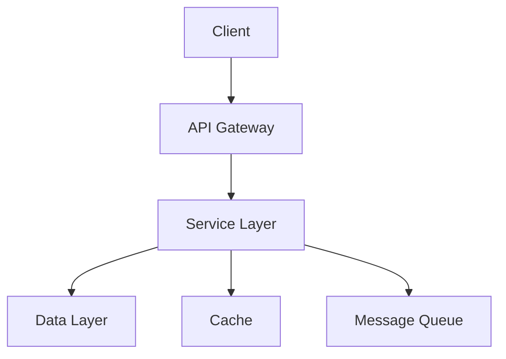
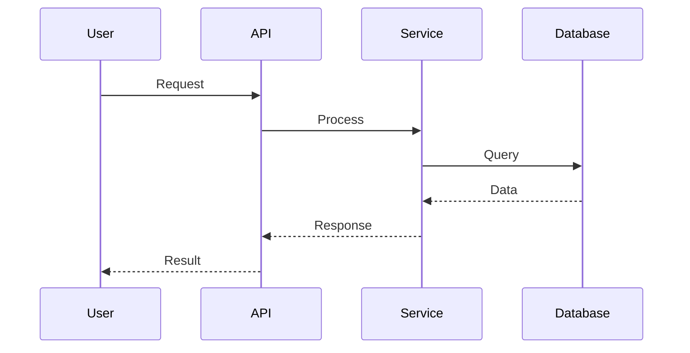
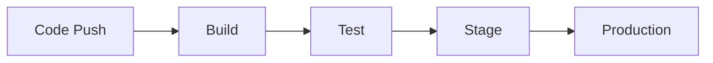

# {Project Name} Architecture

> Last Updated: {DATE}

## Executive Summary
{High-level overview of the system architecture and key design decisions}

## System Overview

### Architecture Diagram


### Core Components
1. **Component A** - {Description and responsibility}
2. **Component B** - {Description and responsibility}
3. **Component C** - {Description and responsibility}

## Technical Stack

### Backend
- **Language:** {e.g., Node.js, Python, Java}
- **Framework:** {e.g., Express, Django, Spring}
- **Database:** {e.g., PostgreSQL, MongoDB}
- **Cache:** {e.g., Redis, Memcached}

### Frontend
- **Framework:** {e.g., React, Vue, Angular}
- **State Management:** {e.g., Redux, MobX}
- **Build Tool:** {e.g., Webpack, Vite}

### Infrastructure
- **Cloud Provider:** {e.g., AWS, GCP, Azure}
- **Container:** {e.g., Docker, Kubernetes}
- **CI/CD:** {e.g., GitHub Actions, Jenkins}

## Design Patterns

### Architectural Patterns
- **Pattern:** {e.g., Microservices, Monolithic, Serverless}
- **Justification:** {Why this pattern was chosen}

### Design Patterns Used
1. **Repository Pattern** - Data access abstraction
2. **Factory Pattern** - Object creation
3. **Observer Pattern** - Event handling

## Data Architecture

### Data Flow


### Database Schema
```sql
-- Example schema structure
CREATE TABLE users (
    id UUID PRIMARY KEY,
    email VARCHAR(255) UNIQUE,
    created_at TIMESTAMP
);
```

### Data Storage
- **Primary Database:** {Type and purpose}
- **Cache Strategy:** {Caching approach}
- **File Storage:** {How files are handled}

## API Design

### REST API Principles
- Resource-based URLs
- HTTP methods for operations
- Stateless communication
- JSON response format

### API Versioning Strategy
- URL versioning: `/api/v1/resource`
- Header versioning support

### Authentication & Authorization
- **Method:** {e.g., JWT, OAuth2}
- **Token Lifetime:** {Duration}
- **Refresh Strategy:** {How tokens are refreshed}

## Security Architecture

### Security Layers
1. **Network Security** - Firewall, VPN
2. **Application Security** - Input validation, CSRF protection
3. **Data Security** - Encryption at rest and in transit

### Security Measures
- [ ] HTTPS/TLS encryption
- [ ] Input sanitization
- [ ] SQL injection prevention
- [ ] XSS protection
- [ ] Rate limiting
- [ ] API key management

## Performance Considerations

### Optimization Strategies
- **Caching:** Multi-level caching strategy
- **Database:** Query optimization, indexing
- **API:** Response compression, pagination
- **Frontend:** Code splitting, lazy loading

### Scalability
- **Horizontal Scaling:** Load balancing strategy
- **Vertical Scaling:** Resource allocation
- **Auto-scaling:** Triggers and thresholds

## Deployment Architecture

### Environments
1. **Development** - Local development setup
2. **Staging** - Pre-production testing
3. **Production** - Live environment

### Deployment Pipeline


## Monitoring & Logging

### Monitoring Stack
- **Application Monitoring:** {e.g., New Relic, DataDog}
- **Infrastructure Monitoring:** {e.g., CloudWatch, Prometheus}
- **Error Tracking:** {e.g., Sentry, Bugsnag}

### Logging Strategy
- **Log Levels:** DEBUG, INFO, WARN, ERROR, FATAL
- **Log Aggregation:** {e.g., ELK Stack, Splunk}
- **Retention Policy:** {Duration and archival}

## Disaster Recovery

### Backup Strategy
- **Frequency:** {How often backups occur}
- **Retention:** {How long backups are kept}
- **Recovery Time Objective (RTO):** {Target recovery time}
- **Recovery Point Objective (RPO):** {Acceptable data loss}

### Failover Procedures
1. {Step-by-step failover process}
2. {Rollback procedures}

## Future Considerations

### Planned Improvements
- [ ] {Future enhancement 1}
- [ ] {Future enhancement 2}
- [ ] {Future enhancement 3}

### Technical Debt
- {Known issues to address}
- {Refactoring needs}

## Architecture Decision Records (ADRs)

### ADR-001: {Decision Title}
- **Status:** {Accepted/Rejected/Deprecated}
- **Context:** {Why this decision was needed}
- **Decision:** {What was decided}
- **Consequences:** {Impact of the decision}

## References

- [System Design Document](./DESIGN.md)
- [API Documentation](./API.md)
- [Database Schema](./DATABASE.md)
- [Security Policy](../../standards/security/POLICY.md)